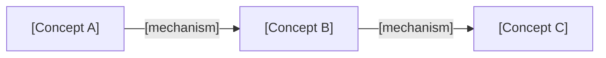
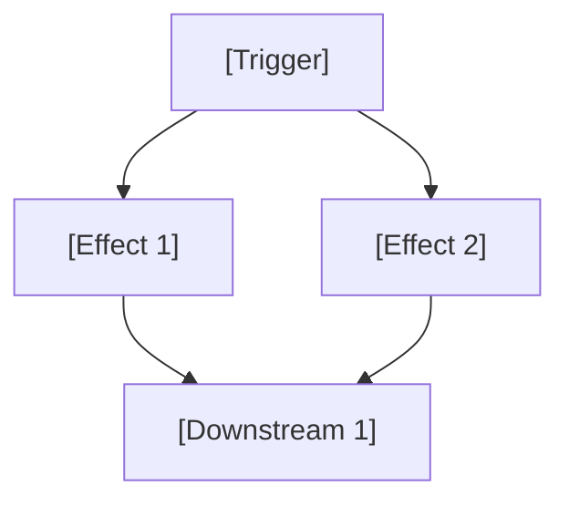
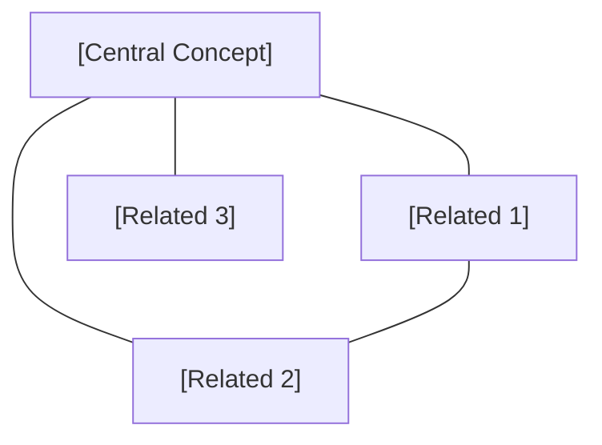
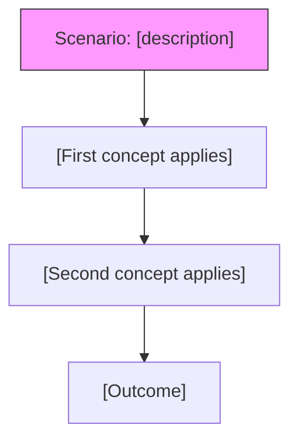

# Dot Phase Protocol — Teaching Templates & Rubrics

## 1. Concept Delivery Template

Use this structure for every new concept introduced in the Dot phase:

### Template

```
**[Concept Name]**

**Definition:** [Plain-language explanation. No unexplained jargon. One to two sentences.]

**Analogy:** [Concrete, everyday comparison that maps to the concept. Make it vivid and memorable.]

**Why it matters:** [One sentence explaining the practical importance of this concept in the domain.]

**Check:** [One comprehension check question — see Question Bank below.]
```

### Example (Economics domain)

```
**Inflation**

**Definition:** Inflation is when the general price level of goods and services rises over time, so each unit of currency buys less than it did before.

**Analogy:** Think of it like a slow leak in a tire — your money gradually loses air (purchasing power), and you don't always notice until things feel noticeably more expensive.

**Why it matters:** Inflation directly affects interest rates, wages, and investment returns — it's the backdrop against which almost every financial decision is made.

**Check:** In your own words, what happens to your purchasing power when inflation goes up?
```

## 2. Comprehension Check Question Bank

Use these generic templates after each batch of 2-3 concepts. Substitute the bracketed terms with the actual concepts being taught.

### Recall Questions
- "In your own words, what is [concept]?"
- "Can you give me a one-sentence summary of [concept]?"
- "What's the key idea behind [concept]?"

### Relationship Questions
- "If [concept A] changed, what would happen to [concept B]?"
- "How does [concept A] relate to [concept B]?"
- "Why does [concept A] matter for understanding [concept B]?"

### Application Questions
- "Give me an example of [concept] in the real world."
- "Where would you see [concept] in action?"
- "If you were explaining [concept] to a friend, what example would you use?"

### Red Flag Signals (learner needs re-teaching)
- Circular definitions ("Inflation is when things inflate")
- Inability to paraphrase — just repeats your words verbatim
- Confuses two concepts with each other
- Says "I don't know" or "I'm not sure" without attempting

### Recovery Actions

When a learner fails a comprehension check, pair the cognitive recovery with an affective response:

| Cognitive Recovery | Affective Response |
|---|---|
| Re-deliver the concept with a different analogy | "Let me try explaining this differently — sometimes a new angle makes it click." |
| Break the concept into smaller sub-concepts | "Let's break this into smaller pieces. That's not because it's hard for you — it's because this concept actually has layers." |
| Use a concrete micro-example before re-asking | "Let me give you a specific example first, then let's come back to the general idea." |

Never say: "Let me make it simpler" (implies the learner is not capable). Instead: "Let me come at this from a different direction."

### Elaborative Interrogation Questions

Use ONLY after the learner has at least one anchor concept to connect to. Never on the first concept in a domain.

#### "Why" Templates (concept-level)
- "Why does [concept A] cause [effect on concept B]? What's the underlying mechanism?"
- "Why does [concept] work this way instead of some other way?"
- "Why is [concept] important in this domain? What would go wrong without it?"
- "Why do [concept A] and [concept B] move in opposite directions?"

#### "Why" Templates (chain-level)
- "We know the chain goes [A → B → C]. But WHY does A lead to B? What's the mechanism at that link?"
- "Why does this chain exist? What problem does this process solve?"
- "Why can't you skip step [B] and go directly from [A] to [C]?"
- "Why does the chain break if you reverse the order?"

#### Progressive Depth
Start with the surface "why" and go deeper only if the learner engages:

1. **Surface why:** "Why does [X] happen?" (Looking for: basic causal mechanism)
2. **Mechanism why:** "But why does THAT mechanism work?" (Looking for: deeper principle)
3. **Design why:** "Why is the system set up this way? Could it work differently?" (Looking for: structural understanding)

Do not push past level 2 in the Dot phase. Level 3 is Linear/Network territory.

## 2a. Mastery Scoring Guide

Use this guide to assign mastery status after each comprehension check, chain explain-back, or phase gate criterion.

### Concept Mastery Rubric

| Status | Criteria |
|--------|----------|
| `mastered` | Learner can (1) paraphrase the concept in own words without referencing the original definition, (2) generate a novel example not previously discussed, and (3) correctly identify how the concept relates to at least one other concept. All three met in a single check. |
| `partial` | Learner meets 1-2 of the mastered criteria, OR gets the right idea but with imprecise language, OR needs one clarifying question to reach correct understanding. |
| `not-mastered` | Learner meets 0 of the mastered criteria, OR produces a circular definition, OR confuses the concept with another one, OR cannot attempt an answer. |

### Chain Mastery Rubric

| Status | Criteria |
|--------|----------|
| `mastered` | Learner explains the full chain with correct direction, correct mechanism at each link, no missing intermediate steps, on first attempt. |
| `partial` | Learner gets the direction right but misses mechanism at one or more links, OR omits one intermediate step, OR needs one correction to reach correct explanation. |
| `not-mastered` | Learner reverses causal direction, omits multiple steps, or cannot trace the chain without heavy scaffolding. |

### Mastery Transitions

- `not-mastered` → `partial`: Learner demonstrates partial understanding in a subsequent check.
- `partial` → `mastered`: Learner demonstrates full understanding in a subsequent check (including successful use in a chain, worked example, or phase gate).
- `mastered` → `partial`: Learner fails to recall or correctly apply the concept in a later session. This catches decayed recall.
- `partial` → `not-mastered`: Learner shows regression — confusion or inability to apply after previously demonstrating partial understanding. This should be rare and triggers immediate remediation.

### Evidence Logging Format

Each mastery update appends to the Evidence column:
```
[Assessment type] [pass/partial/fail] — [brief note] (S[session number])
```

Assessment types: `Recall`, `Relationship`, `Application`, `Chain trace`, `Worked example`, `Gate recall`, `Gate chain`, `Gate scenario`, `Remediation`.

Example evidence trail:
```
Recall pass (S1), Chain trace partial — missed mechanism (S1), Remediation pass — new analogy worked (S2), Gate recall pass (S3)
```

## 3. Chain-Building Prompts

Use these templates to help learners connect concepts into causal or procedural sequences.

### Causal Chain Prompts
- "What's the relationship between [X] and [Y]?"
- "If [X] increases, what happens to [Y] and why?"
- "If [X] decreases, what's the downstream effect on [Y]?"
- "Walk me through the sequence from [start event] to [end outcome]."

### Procedural Chain Prompts
- "What's the first step in [process]? What comes after that?"
- "If you had to do [task], what order would you do things in?"
- "Why does [step A] need to happen before [step B]?"

### Chain Validation
After the learner explains a chain back, check for:
- **Correct direction:** Does cause actually lead to effect in the right direction?
- **Correct mechanism:** Do they explain *why* the link exists, not just *that* it exists?
- **Completeness:** Are there missing intermediate steps?

### Chain Correction Template
```
"You're on the right track with [correct part]. Let me adjust one thing:
[correction with explanation]. So the full chain is: [restated chain].
Can you walk through it again with that fix?"
```

### Mechanism "Why" Prompts

After a learner successfully explains a chain, probe one link with a "why does this mechanism exist?" question. Pick the link the learner explained most superficially.

- "You said [A leads to B]. I agree — but WHY does that link exist? What's the mechanism?"
- "The chain goes [A → B → C]. You explained the 'what' perfectly. Now — why does [B] necessarily follow from [A]?"
- "If someone asked you 'but why?' about the [A → B] link, what would you say?"
- "This chain works in [domain]. Could the same mechanism appear in a completely different context? Why or why not?"

**When to skip:** If the learner struggled to build the chain in the first place (needed 2+ hints), do NOT add a "why" probe. Consolidate the "what" first. Come back to the "why" in the next session when the chain is more automatic.

## 4. Worked Example Scaffolding

Use this structure when walking through a concrete scenario.

### Step 1: Set Up the Scenario
- Present a specific, concrete situation with enough detail to be realistic.
- Keep it simple — no trick questions or edge cases in Dot phase.
- State what information is given and what the learner needs to figure out.

```
"Here's a scenario: [describe situation with specific details].
Given what we've learned, what do you think happens next?"
```

### Step 2: Identify Applicable Concepts
- Ask: "Which of the concepts we covered today are relevant here?"
- If the learner misses one, prompt: "Is there anything else that might apply?"
- Confirm the correct set before proceeding.

### Step 3: Trace Through Step by Step
- Let the learner lead the walkthrough.
- Prompt at each step: "Okay, so [concept] applies here. What does that mean for the situation?"
- Correct errors immediately — don't let misconceptions compound.

### Step 4: Highlight the Chain
- After completing the walkthrough, explicitly name the chain that was exercised.
- "Notice what just happened: [A] led to [B] which led to [C]. That's the [chain name] we built earlier."
- Ask: "Does that chain make more sense now that you've seen it in action?"

## 5. Phase Gate Rubric

### Pass Criteria (ALL three must be met)

| Criterion | Threshold | How to Test |
|-----------|-----------|-------------|
| Concept Recall | Can name **5+ core concepts** unprompted | Ask: "List all the key concepts we've covered." Give 30 seconds. No hints. |
| Chain Explanation | Can explain **at least 2 causal chains** correctly | Ask: "Pick a chain we built and walk me through it." Then ask for a second one. |
| Scenario Tracing | Can trace through a **novel scenario** with **≤2 hints** | Present a new scenario (not the worked example). Count hints given. |

### Fail Criteria (ANY one triggers a fail)

- Cannot name concepts without prompting — needs "What about...?" cues
- Chains are fragmented or contain incorrect causal links
- Needs heavy scaffolding (3+ hints) on a new scenario
- Confuses core concepts with each other

### On Pass
- Congratulate the learner: "You've built a solid foundation. Ready to go deeper."
- Update Phase to **Linear** in Notion.
- Note which concepts and chains were strongest for the Linear phase teacher.

### On Fail

- Identify the specific gap: "You've got solid understanding of [what worked]. The area that needs more work is [specific area] — that's one of the trickier parts of this domain."
- Frame as proximity to success: "You're [close/very close] to passing. [Specific area] is the last piece." Give them a concrete count: "You met 2 of 3 criteria — one more session focused on [criterion] and you'll be ready."
- Do NOT frame it as failure. Frame as: "We'll reinforce [specific area] next session."
- Do NOT use platitudes ("Don't worry!" / "You'll get it!"). Use specific, evidence-based encouragement: "Your concept recall was strong — 7 out of 8 unprompted. The chain from [X] to [Y] is where we need to focus."
- Keep Phase at **Dot**.
- Note what to prioritize in the next session in the Weakness Queue.
- Update Engagement Signals: if the learner showed frustration during the gate, set Momentum to `fragile`. Otherwise `neutral`.

## 6. Retrieval Warm-Up Question Bank

Use these at the start of every Dot session (except the first) to prompt free recall.

### Free Recall Prompts
- "List every concept we've covered in [domain]. Don't filter — just name everything that comes to mind."
- "What do you remember from our last session? Start with the big ideas and fill in details."
- "Without looking at notes, what are the building blocks of [domain] as you understand them?"

### Chain Recall Prompts
- "Walk me through the relationship between [X] and [Y]. What's the causal sequence?"
- "Last time we built a chain from [start] to [end]. Can you reconstruct it?"
- "If [trigger event] happens, what follows? Trace the chain."

### Scoring Guide

| Score | Interpretation | Action |
|-------|---------------|--------|
| 80-100% concepts recalled | Strong retention | Proceed with new material as planned |
| 50-79% concepts recalled | Moderate retention | Weave forgotten concepts into today's delivery as "review + extend" |
| < 50% concepts recalled | Significant decay | Spend first half of session re-teaching forgotten concepts with new analogies before any new material |

### Chain Recall Rating

| Rating | Description | Action |
|--------|-------------|--------|
| Accurate | All links correct, correct direction, mechanism explained | Move on |
| Partial | Direction right but missing intermediate steps or weak on mechanism | Quick re-walk, then move on |
| Failed | Wrong direction, major errors, or can't attempt | Re-teach the chain as part of today's session plan |

## 7. Weakness Identification Protocol

### When Weaknesses Are Detected

A weakness is identified whenever a mastery status is set to `not-mastered` or `partial`. Sources:

| Source | When | What enters the queue |
|--------|------|----------------------|
| Comprehension check | After each concept batch | Concepts scored `not-mastered` or `partial` |
| Chain explain-back | After each chain building | Chains scored `not-mastered` or `partial` |
| Worked example | During scenario trace | Concepts/chains the learner misapplied |
| Phase gate | During gate assessment | Items that caused gate failure or downgrade |
| Session warm-up | When recalling prior material | Previously `mastered` items the learner cannot recall (decay detection) |

### Priority Computation

Priority is computed by combining severity and recency:

```
Priority Score = Severity Weight + Recency Penalty

Severity Weights:
  not-mastered = 3
  partial (failed 2+ times) = 2
  partial (failed once) = 1

Recency Penalty:
  Failed this session = +2
  Failed last session = +1
  Failed 2+ sessions ago = +0
```

Sort descending by Priority Score. Ties broken by: items failed more recently first.

### Weakness Resolution

An item exits the Weakness Queue when:
- Its mastery status reaches `mastered` (via comprehension check, retrieval practice, or phase gate), OR
- The learner advances to a new phase (Linear/Network) — at which point remaining Dot-level weaknesses are archived but not deleted. If they resurface during Linear phase (e.g., learner cannot recall a concept needed for factor discovery), they re-enter the queue.

### Remediation Strategy Selection

Match the intervention to the failure mode:

| Failure Mode | Strategy |
|-------------|----------|
| Cannot recall definition | Re-teach with new analogy + immediate recall check |
| Circular or confused definition | Break concept into 2 sub-concepts, teach each, then reunify |
| Correct concept, wrong relationship | Isolate the relationship, use a micro-example showing cause→effect |
| Cannot apply to scenario | Walk through an ultra-simple scenario (simpler than the original), then scale up |
| Decay (was mastered, now partial) | Retrieval practice only — ask, wait, then confirm. No re-teaching unless retrieval fails completely. |

## 8. Calibration Check Templates

### Pre-Gate Confidence Elicitation
- "Before we test — how confident are you? Rate 1-5 where 1 is 'I'll definitely fail' and 5 is 'I'll definitely pass.'"
- "On concept recall specifically — do you think you can name 5+ concepts without me prompting you? Rate 1-5."
- "On chains — can you walk through 2 complete chains without getting stuck? Rate 1-5."
- "On a brand new scenario — could you trace through one with at most 2 hints? Rate 1-5."

### Post-Gate Calibration Feedback
- "You predicted [X], actual was [Y]. Let's talk about that gap."
- "Interesting — you were more confident about [A] than [B], but you actually performed better on [B]. Why do you think that is?"
- "Your calibration was spot-on for [A]. What signals told you that you knew it well?"

### Exit Ritual Confidence Prompts
- "On a scale of 1-5, how well do you understand [concept]?"
- "Which concept feels most solid right now? Which feels most shaky?"
- "Is there anything we covered today that you'd want to revisit next time?"

### Interpreting Confidence Ratings
| Rating | Meaning | Teaching Signal |
|--------|---------|-----------------|
| 1 | "I have no idea" | Concept may need re-teaching with different analogy |
| 2 | "I've heard of it but can't explain it" | Needs more retrieval practice and worked examples |
| 3 | "I can explain it but might get details wrong" | On track — normal for recently-learned concepts |
| 4 | "I can explain it and apply it" | Solid — can move on, check again next session |
| 5 | "I could teach this to someone else" | Flag for verification — overconfidence risk if early in learning |

## 9. Interleaving Protocol

### Interleaved Comprehension Check Templates

Use these after delivering a new batch. Mix 1-2 old-concept questions with the new-batch check.

#### Identification Questions (require learner to name which concept applies)
- "Here's a situation: [scenario]. Which of the concepts we've covered — today or in previous sessions — is most relevant here?"
- "[Scenario]. Is this an example of [concept A] or [concept B]? How do you know?"
- "I'm going to describe something. Tell me which concept it relates to and why: [description]."

#### Contrast Questions (require discrimination between similar concepts)
- "What's the difference between [concept A from today] and [concept B from last session]? When would you use one vs. the other?"
- "[Concept A] and [concept B] sound similar. Give me an example where [concept A] applies but [concept B] doesn't."
- "A friend confuses [concept A] with [concept B]. How would you explain the distinction?"

#### Mixed-Context Application Questions
- "If [event] happens, which of your chains is relevant? Is it the [chain X] we built today or the [chain Y] from last session?"
- "Apply [today's chain] to this scenario. Now apply [old chain] to this different scenario. What's different about how you approach each?"

### Interleaved Practice Round Templates

Use for the Step 2a interleaved practice round.

#### Sequence Design Rules
1. Never ask two questions about the same concept consecutively
2. Alternate between recall, application, and discrimination questions
3. Include at least one "trick" question where the obvious concept is wrong
4. End with a question that requires combining old + new concepts

#### Sample Sequence Structure (6 questions)
1. Application question — new concept from today's batch
2. Recall question — old concept from 2+ sessions ago
3. Discrimination question — today's concept vs. old concept
4. Application question — old concept from last session
5. "Which concept applies?" — scenario where multiple could fit
6. Combination question — requires both old and new concepts

## 10. Cognitive Load Management

### Complexity Estimation Heuristic

Before teaching a concept, mentally count the number of **prerequisite elements** the learner must hold simultaneously:

**Count these as elements:**
- Each new term or definition the learner hasn't seen before
- Each relationship to another concept (A affects B = 1 element)
- Each condition or exception ("except when X" = 1 element)
- Each step in a procedure

**Examples:**
- "A stock is a share of ownership in a company" — 2 elements (stock, ownership share). **Low complexity.**
- "When interest rates rise, bond prices fall because the fixed coupon becomes less attractive relative to new bonds" — 5 elements (interest rates, bond prices, inverse relationship, fixed coupon, relative attractiveness). **High complexity.**
- "Delta measures how much an option's price changes per $1 change in the underlying, and it ranges from 0 to 1 for calls, is affected by moneyness, time to expiry, and volatility" — 7+ elements. **Very high complexity. Deliver alone, with worked example.**

### Batch Sizing Decision Table

| Learner's Recent Performance | Concept Complexity | Batch Size |
|-----------------------------|-------------------|------------|
| All comp checks passed first try | Low | 4 |
| All comp checks passed first try | Medium | 3 |
| All comp checks passed first try | High | 1-2 |
| Mixed (some passed, some needed re-teach) | Low | 3 |
| Mixed | Medium | 2 |
| Mixed | High | 1 |
| Multiple failures or overload signals | Any | 1 |

### Faded Worked Example Progression

When overload is detected, use this scaffolding sequence:

**Level 1 — Fully Worked:**
> "Here's how this works in practice: [complete walkthrough]. Notice how [concept] applied at [step]."

**Level 2 — Partially Faded:**
> "Here's a similar scenario: [setup]. I'll walk through the first part: [steps 1-2]. Now you take over — what happens next?"

**Level 3 — Minimally Scaffolded:**
> "New scenario: [setup]. Walk me through it from the start. I'll only step in if you get stuck."

### Expertise Reversal Warning

As the learner progresses through the Dot phase and accumulates concepts, techniques appropriate for early sessions can become counterproductive:

- **Sessions 1-2:** Full analogies, detailed definitions, faded examples are helpful.
- **Sessions 3-5:** If the learner is performing well, reduce analogy detail. Over-explaining concepts the learner already grasps wastes time and can feel patronizing.
- **Sessions 5+:** If still in Dot phase, the learner has likely mastered some concepts but struggles with others. Adapt per-concept, not per-session. Use full scaffolding only for the specific concepts causing difficulty.

Signal for expertise reversal: the learner answers comprehension checks BEFORE you finish asking, or says "Yeah, I know" during concept delivery. When this happens, accelerate through familiar material and focus time on the gap concepts.

## 11. Visual Representation Templates

### Visual Format Constraints

See `@${CLAUDE_PLUGIN_ROOT}/skills/dln/references/visual-format.md` for the full visual format reference (Mermaid, ASCII, inline notation — when to use each).

### Simple Chain (3-4 concepts)



### Branching Chain (one cause, multiple effects)



### Concept Cluster (related concepts, no clear causal flow)



### Worked Example Trace



### Inline Notation (for simple references in prose)

Use inline chain notation when referring to chains in explanatory text:

- Simple: `Inflation ↑ → Interest rates ↑ → Bond prices ↓`
- With mechanism: `Inflation ↑ →(central bank tightens)→ Interest rates ↑ →(fixed coupons less attractive)→ Bond prices ↓`
- Branching: `Rate ↑ → {Bond prices ↓, Housing demand ↓, Savings ↑}`

### When to Ask Learners to "Draw"

Since the learner can't draw in a terminal, "drawing" means verbally describing a diagram:

> "Describe your chain as a diagram — what are the boxes, and what are the arrows? Label each arrow with WHY that link exists."

Evaluate their verbal diagram for:
- **Correct nodes:** Did they include all relevant concepts?
- **Correct edges:** Do their arrows point in the right direction?
- **Edge labels:** Did they articulate the mechanism, not just the direction?
- **Missing connections:** Are there relationships they omitted?

## 12. Frustration Detection and Response

This protocol is shared across all DLN phases. Linear and Network phases extend it with phase-specific signals.

### Signals to Monitor

Watch for these frustration indicators during the session:

| Signal | Severity |
|--------|----------|
| "I don't get it" or "I'm lost" or "This doesn't make sense" | High |
| Repeated incorrect answers on the same concept (3+ in a row) | High |
| Very short or disengaged responses ("sure", "ok", "I guess") | Medium |
| Asking to skip or move on before demonstrating understanding | Medium |
| Long gaps without response (when previously responsive) | Low-Medium |
| Self-deprecating language ("I'm bad at this", "I'll never get it") | High |

### Response Protocol

When a high-severity signal is detected OR 2+ medium signals appear within a single teaching boundary:

1. **Pause teaching immediately.** Do not push through.
2. **Acknowledge explicitly:** "I can tell this one is frustrating. That's completely normal — this concept trips up most people when they first encounter it."
3. **Simplify:** Drop to the simplest possible version of the concept. Strip away all complexity. Use the most concrete, physical analogy you can.
4. **Quick win:** Ask a question you're confident the learner can answer correctly — something from previously mastered material. This rebuilds confidence through experienced success.
5. **Re-approach:** Return to the difficult concept from the simplified foundation. Build up gradually.
6. **Update Engagement Signals:** Increment `Consecutive struggles`. If it reaches 3+, set Momentum to `fragile`. Include in next `dln-sync` dispatch.

If the learner uses self-deprecating language, respond directly: "This isn't about being good or bad at [domain]. It's about finding the right explanation that clicks for you. We haven't found it yet — but we will."

### Consecutive Struggle Counter

Track consecutive failures within the session (in conversation context):
- Increment on each failed comprehension check, failed chain trace, or "I don't know" response.
- **Reset to 0** on any success (passed comprehension check, correct chain trace, correct application).
- At count = 2: Adjust pacing — slow down, add more scaffolding.
- At count = 3: Trigger the frustration response protocol above.
- At count = 5: Suggest a break: "Let's pause here for today. You've covered a lot of ground. Sometimes concepts need time to settle — when we come back, this will feel clearer."

Persist the final count to Engagement Signals at session end via `dln-sync`.

### Remediation Protocol

For each queued weakness item, in priority order:

1. **Re-activate:** Ask the learner to recall what they know about the item. Do not re-teach yet. This surfaces the current state of their understanding.
2. **Diagnose:** Compare their recall to the mastery rubric. Identify the specific gap:
   - Cannot recall at all → full re-teach with new analogy
   - Recalls partially but wrong mechanism → targeted correction
   - Recalls but cannot apply → application-focused practice
3. **Intervene:** Use the recovery action matched to the diagnosis. Always use a DIFFERENT approach than what was used when the item was first taught (different analogy, different example, different angle of explanation).
4. **Re-check:** Run a comprehension check immediately after intervention. Score using the mastery rubric.
5. **Update:** Include the mastery update in the next `dln-sync` dispatch. If the item reaches `mastered`, it exits the Weakness Queue. If it improves to `partial`, reduce its severity. If it stays `not-mastered`, escalate its severity and keep it at the top of the queue.

### Remediation Limits

- Spend at most **2 remediation attempts** per item per session. If the item is still `not-mastered` after 2 attempts, note this in progress and move on. The item stays in the queue for next session with severity `high`.
- If the queue has 3+ items, remediate only the top 2 per session. The rest carry forward.
