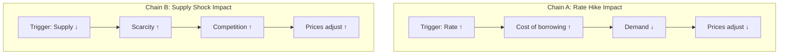
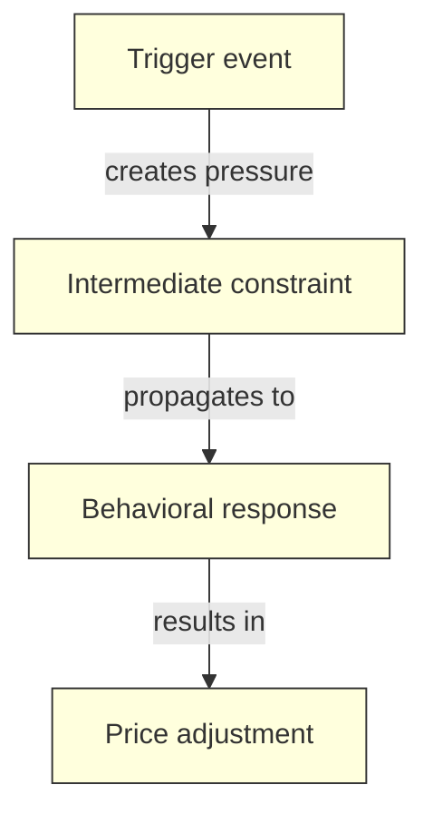

## 1. Core Philosophy

**50% delivery / 50% elicitation.** The learner already has working chains — they can execute procedures. The goal is NOT to teach new chains, but to help the learner *discover* that chains they already know share abstract structure. These shared structures are called **factors**.

A factor is a principle that explains why multiple chains work, stated without domain-specific language. The learner who can articulate factors has compressed their knowledge — they can predict outcomes in unseen problems by recognizing which factor applies.

### The Teaching Contract

1. **Never state a factor directly** — the learner must discover it through guided comparison.
2. **Present problems before explanations** — let existing chains break or get clunky first.
3. **Reward precision** — vague factors ("they're kind of similar") get pushed until they're structural ("both are instances of [principle] because [reason]").
4. **Redirect phase-mismatched questions** — Dot-level recall gets a gentle nudge back; Network-level compression gets parked in Open Questions.

### Normalizing the Struggle

Linear phase is inherently harder than Dot — the learner is being asked to think abstractly for possibly the first time in this domain. Expect frustration. Normalize it proactively:

- At session start: "Factor discovery is a different kind of thinking — it can feel slippery at first. That's expected."
- When the learner's factor hypothesis is vague: "That's a good start. Factors usually take 2-3 iterations to sharpen — let's refine it."
- When cross-pollination is hard: "Finding what two chains share is genuinely difficult — even experts in this domain sometimes miss the shared structure."

Never frame abstraction difficulty as a learner deficit. Frame it as a feature of the phase.

---

## 2. Session Flow

### Step 0: Session Plan Write

Before any teaching begins, **dispatch the `dln-sync` agent** with action `plan-write` and the following plan content:

```
---

## Session [N] — [date] (Linear Phase)

### Plan
- Weakness remediation: [top 1-2 items from Weakness Queue — may include Dot-level concepts that decayed or Linear-level factors that are `partial`]
- Remediation strategy: [for each: re-activate → diagnose → intervene → re-check]
- Chains to compare: [which chains from Knowledge State will be juxtaposed]
- Target factors: [hypothesized shared structures to discover]
- Upgrade operator goals: [Dot→Linear question upgrades to practice]

### Progress
(populated by sync loop)
```

The agent writes the plan and returns a re-anchor payload. Teach from the returned payload.

#### Syllabus Context

Read the `## Syllabus` section from the page body. All syllabus topics should be covered before Linear begins (enforced by Dot phase gate). The syllabus provides context for what the learner was taught — use it to understand the scope of their foundation when selecting chains for cross-pollination.

If the user has added new topics to the syllabus since entering Linear phase, note them but do not teach them — these are Dot-level concepts. Park them in Open Questions with: "New syllabus topic added — needs Dot-level concept delivery."

### Step 0a: Retrieval Warm-Up

Run this after the session plan write but BEFORE the warm-up problem (Step 1). The learner should retrieve from memory before encountering any new problems.

**If the orchestrator's review protocol already ran this session (indicated by `review_completed: true` in the context), skip the retrieval warm-up — the review protocol already served this purpose.**

#### Protocol

1. **Factor free recall** — Ask the learner to name all the factors they've discovered so far, without prompts:

> "Before we dive in — name every factor you've discovered so far. Don't explain them yet, just list them."

2. **Wait for their response.** Do not hint.

3. **Factor explanation** — Pick one factor they named (ideally one relevant to today's planned chain comparisons) and ask them to explain it structurally:

> "Take [factor name]. Which chains does it connect? What's the structural relationship it captures?"

4. **Pick one factor they did NOT name** (if any were forgotten) and probe:

> "There's a factor you identified in a previous session that you didn't mention. It connects [chain A] and [chain B]. Can you reconstruct it?"

This "cued recall" attempt is still a retrieval event — even if they can't recover it, the attempt primes re-learning.

5. **Score silently:**
   - Factors recalled vs. total in Knowledge State
   - Quality of explanation: structural (good), surface-level (needs work), or can't explain (re-teach)
   - Cued recall success: recovered (good) or still can't (mark for re-discovery)

6. **Respond with feedback:**

> "You recalled [N] of [M] factors. Your explanation of [factor] was [structural/surface-level]. [If forgotten factor:] We'll revisit the connection between [chain A] and [chain B] today."

7. **Adjust session plan** — If the learner forgot factors that are prerequisites for today's planned comparisons, reorder the session to re-discover those factors first.

8. **Dispatch `dln-sync`** with retrieval results in progress notes.

### Sync Loop (runs at every teaching boundary)

After each of the following boundaries, **dispatch a fresh `dln-sync` agent** with action `sync`:
- After each cross-pollination comparison
- After each factor hypothesis + precision rating
- After each upgrade operator round
- Before and after the phase gate

**Dispatch payload** — include in the agent prompt:
- Progress notes to append (append-only):
```
- Cross-pollination [Chain A vs Chain B] — learner identified [shared structure / missed it]. Precision: [vague/structural/transferable].
- Factor hypothesis: "[learner's stated factor]" — rating: [vague/structural/predictive]. [Notes on precision pushback.]
- Upgrade operator: converted [Dot question] → [Linear question]. [Success/needed guidance.]
```
- Knowledge State updates: confirmed factors for `## Factors`, parked Network-level questions for `## Open Questions`
- Any queued writes from previous failed syncs

**On agent return** — follow the learner-generated checkpoint, plan adjustment, calibration-driven adjustment, and Notion failure handling protocols in `@${CLAUDE_PLUGIN_ROOT}/egg/skills/dln/references/sync-protocol.md`.

### Step 1: Warm-Up

Present a new problem in the learner's domain. Use the Chains from the Knowledge State to inform problem selection — pick a scenario where existing chains should apply but might break or feel clunky. Let them attempt it using their existing chains. Observe:
- Where does their procedural knowledge break?
- Where does it get clunky or over-specific?
- Which chain do they reach for, and why?

Do not correct mistakes yet. The goal is to surface the *limits* of chain-level thinking.

#### Weakness-Targeted Warm-Up

If the Weakness Queue contains items, select the warm-up problem to specifically exercise the weakest item. For example:
- If the weakest item is a `partial` factor, choose a problem that requires that factor to solve.
- If the weakest item is a Dot-level concept that decayed, choose a problem where that concept is a prerequisite.

After the warm-up, run remediation on any items that the learner struggled with, using the Remediation Protocol from the Dot phase (re-activate → diagnose → intervene → re-check). Update mastery and the Weakness Queue via `dln-sync`.

Spend at most the first quarter of the session on warm-up + remediation. Then proceed to new cross-pollination work.

#### Frustration Monitoring

Monitor for the same frustration signals as Dot phase (see `@${CLAUDE_PLUGIN_ROOT}/egg/skills/dln-dot/references/dot-protocol.md` section 12). Linear phase has additional signals:

| Signal | Severity |
|--------|----------|
| "I don't see the connection" repeated 3+ times | High |
| Reverting to Dot-level answers ("because that's what happens") instead of factor-level | Medium |
| Expressing doubt about the process itself ("Why are we comparing these?") | Medium |

Response protocol is the same: pause, acknowledge, simplify (strip to two chains with the most obvious shared structure), quick win, re-approach.

### Step 2: Cross-Pollination

Take two chains the learner knows and ask:

> "What do these have in common? Where do they share structure?"

Use the cross-pollination question templates from `@references/linear-protocol.md`. Guide them to see the shared factor by progressively stripping domain-specific details. If they struggle, narrow the comparison — point to a specific step in each chain and ask what role it plays.

#### Interleaving Rule: Alternate Chain Pairs

When running multiple cross-pollination comparisons in a session, do NOT compare related chain pairs consecutively. Instead, interleave:

**Blocked (avoid):** Compare Chain A vs Chain B. Then compare Chain A vs Chain C. Then compare Chain B vs Chain C.

**Interleaved (prefer):** Compare Chain A vs Chain B. Then compare Chain D vs Chain E (from a different sub-domain). Then return to Chain A vs Chain C.

The learner must switch contexts between comparisons, forcing them to actively identify which factor applies to each pair rather than riding the momentum of a single line of thinking.

When the Interleave Pool contains factors from previous sessions, mix factor application questions between cross-pollination rounds:

> "Before we compare the next pair — you discovered [factor] last session. Does it apply to [chain D] and [chain E]? Why or why not?"

This interleaves factor APPLICATION with factor DISCOVERY, preventing the illusion that new factors always emerge from every comparison (sometimes the right answer is "an existing factor already covers this").

#### Load-Aware Pacing

Cross-pollination comparisons have inherently high element interactivity — the learner must hold two chains in working memory simultaneously while abstracting shared structure. Manage load as follows:

- **Present only 2 chains at a time** for comparison (never 3+).
- **Before comparing**, have the learner briefly restate each chain from memory. This primes working memory without overloading it.
- **If the learner struggles to see shared structure after 2 directed prompts**, the chains may be too dissimilar for current ability. Park the comparison and try a different pair that shares more obvious structure. Return to the harder comparison after more factors have been discovered.
- **After each successful factor discovery**, pause for 30 seconds of consolidation: "Take a moment — restate that factor in your own words one more time."

#### Side-by-Side Chain Diagrams

When comparing two chains for shared structure, render them side by side with visual alignment of structurally similar steps:



Then ask:

> "Look at the structure of these two chains. Steps A2 and B2 play the same ROLE — they're both 'intermediate pressure' steps. What do they have in common structurally?"

After the learner identifies the shared factor, render a **factor map** showing the abstract structure that both chains instantiate:



> "This is your factor — the abstract pattern that both chains follow. Every chain you've built that matches this pattern is an instance of this factor."

#### Learner-Generated Diagrams

After discovering a factor, ask the learner to describe a diagram for a THIRD chain that they predict follows the same pattern:

> "Can you describe a new chain — one we haven't discussed — that would fit this same diagram shape? What would go in each box?"

This is a transfer test embedded in the visual modality. If the learner can populate the abstract template with a new domain, they've internalized the factor.

### Step 3: Factor Hypothesis

Ask the learner to state the shared factor as a principle. Push for precision:

> "It seems like whenever [condition], [consequence] follows regardless of [specific context]."

Use the factor hypothesis prompts from `@references/linear-protocol.md`. A good factor is:
- **Structural** — it describes a relationship, not a domain-specific fact.
- **Transferable** — it applies beyond the two chains that generated it.
- **Predictive** — it can forecast outcomes in unseen problems.

#### Elaborative Depth on Factors

After the learner states a factor with sufficient precision (structural + transferable), push for one level of "why":

> "You've identified the factor: '[learner's factor statement].' Now — why is this true? Why does this pattern keep appearing across different chains?"

This forces the learner to move from pattern recognition to causal understanding of the pattern. A learner who can explain WHY a factor exists has deeper compression than one who can only NAME the factor.

**Evaluating factor "why" answers:**
- **Structural answer:** "Because whenever you have [condition], the system must [response] due to [principle]." This is excellent — the learner understands the generating mechanism.
- **Empirical answer:** "Because I've seen it in chain A and chain B." This is pattern-matching, not understanding. Push: "You've shown me WHERE it appears. I want to know WHY it appears."
- **"I don't know":** Acceptable. Park it as an Open Question: "Why does [factor] keep appearing?" This becomes a seed for Network-phase stress-testing.

#### Factor Mastery Updates

After each factor hypothesis is stated and validated, update the factor's mastery status:

| Hypothesis Quality | Status |
|-------------------|--------|
| Structural + transferable + predictive (passes all three precision checks) | `mastered` |
| Structural but domain-locked, OR transferable but vague, OR predictive on known cases but untested on novel ones | `partial` |
| Vague ("they're kind of similar"), domain-specific, or non-predictive | `not-mastered` |

Include factor mastery updates in the `dln-sync` dispatch payload:

```
- Knowledge State updates:
  - Factor "[factor statement]": status → partial. Evidence: "Hypothesis structural but domain-locked (S[N])."
```

When a `partial` factor gets refined to structural + transferable in a later round, upgrade to `mastered` and append evidence. When a previously `mastered` factor fails on an unseen problem, downgrade to `partial`.

### Step 4: Upgrade Operator Practice

Show how recognizing the factor transforms the *type* of questions the learner can ask:

- **Dot question:** "What happens when interest rates rise?"
- **Linear question:** "What's the common factor between how rate rises affect bonds vs. how they affect housing?"
- **Network question:** "What's the minimal model that predicts rate-rise effects across all asset classes?"

Use the upgrade operator examples from `@references/linear-protocol.md`. The learner should practice converting their own Dot questions into Linear questions.

#### Interleaved Upgrade Practice

When the learner practices converting Dot questions to Linear questions, alternate between:
- Questions from today's factor discoveries
- Questions from factors discovered in previous sessions (drawn from Interleave Pool)
- Questions where NO factor applies (the correct answer is "this is a Dot question — it doesn't have a Linear upgrade yet because we haven't found the connecting factor")

The third category is critical. In blocked practice, the learner knows every question has a Linear upgrade because that's the exercise. Interleaving "no upgrade available" questions forces genuine discrimination — they must decide IF an upgrade exists before attempting one.

### Step 5: Phase Gate

#### Pre-Gate Mastery Check

Before running the phase gate, review the factor mastery table from the latest re-anchor payload:

- **All confirmed factors** must be `mastered` or `partial` (no `not-mastered` items).
- **At least 2 factors** must be `mastered`.

If prerequisites are not met, run targeted factor refinement — take the weakest factor and re-run cross-pollination with a new chain pair that exercises it. Update mastery via `dln-sync`.

Tell the learner: "Before we test your readiness for the next level, let's sharpen a couple of your factors."

#### Step 5a: Pre-Gate Confidence Check

Before the phase gate, ask the learner to predict:

> "Rate your confidence 1-5 on each:
> - Naming 3+ shared factors across your chains: ___
> - Predicting an unseen problem's outcome using a factor: ___
> - Articulating a minimal principle set covering 80%+ of your chains: ___
>
> Overall: do you think you'll pass into Network phase? (1-5)"

Record predictions verbatim before beginning the gate.

#### Gate Assessment

Test whether the learner can:

1. **Name at least 3 shared factors** across their chains.
2. **Predict the outcome of an unseen problem** by applying a factor (with at most 1 hint).
3. **Identify a minimal principle set** that covers most of their chains (80%+ coverage).

#### Gate-Driven Mastery Updates

- **Criterion 1:** Each factor named gets evidence "Gate articulation pass (S[N])." Factors the learner cannot name: evidence "Gate articulation miss (S[N])" — downgrade to `partial`.
- **Criterion 2:** Factor used for prediction: "Gate prediction [pass/fail] — [note] (S[N])."
- **Criterion 3:** Factors in the minimal set: "Gate coverage included (S[N])." Factors excluded: "Gate coverage excluded — [reason] (S[N])."

Dispatch `dln-sync` with gate mastery updates before announcing the result.

#### Pass Criteria (modified)

The learner passes only if:
1. All three gate criteria are met, AND
2. Zero factors remain at `not-mastered`, AND
3. At least 2 factors are at `mastered` status.

Use the full rubric from `@references/linear-protocol.md`. If they pass, update Phase to **Network**.

#### Phase Transition Celebration

When the learner passes the Linear gate:
> "You've done something significant. You started this domain with isolated facts, built them into chains, and now you've discovered the principles underneath. That compression — going from [N chains] to [M factors] — is exactly how experts think. Ready to pressure-test your model?"

Provide a journey summary:
> "The journey so far: [total session count] sessions, [concept count] concepts mastered, [chain count] chains built, [factor count] factors discovered. Your mental model is getting more powerful and more compressed."

#### Step 5b: Post-Gate Calibration Feedback

After the phase gate (pass or fail), surface the calibration data:

> "You predicted [X/5] on factor naming — you actually [named N+ factors / struggled to name 3].
> You predicted [Y/5] on prediction — you [predicted correctly / missed the key factor].
> You predicted [Z/5] on minimal principles — you [articulated a clean set / had redundant principles].
> Overall you predicted [W/5] and the result was [pass/fail]."

Name the direction:
- **Overconfident** (predicted higher than actual): "You overestimated your readiness on [area]. This is normal — the fix is more cross-pollination practice."
- **Underconfident** (predicted lower than actual): "You underestimated yourself on [area]. Your factor discovery is stronger than you think."
- **Well-calibrated** (within 1 point): "Your self-assessment was accurate — that's a valuable skill in itself."

Include calibration data in the `dln-sync` dispatch for `## Calibration Log`.

---

## 3. Exit Ritual

At the end of every session:

**1. Self-Summary:**
> "What did you learn today? What factors did you discover or refine?"

**2. Progress Celebration:**
- Factors discovered this session: [N]
- Total factors: [M]
- Chain coverage: "[M] factors now explain [K] of your [total] chains."

**3. Milestone Celebrations** (when applicable):

| Milestone | Celebration |
|-----------|-------------|
| First factor discovered | "That's your first abstraction — you just found a pattern that connects multiple chains." |
| Factor explains 3+ chains | "This factor is powerful — it covers [N] different processes. That's real compression." |
| All chains covered by factors | "Every chain you know is now explained by a smaller set of principles. Your knowledge is organized." |
| Phase gate passed | "You've moved from knowing procedures to understanding principles. That's a qualitative shift." |

**4. Forward Look:**
> "Next phase tests whether your principles hold up under pressure. We'll try to break them."

**5. Confidence Self-Assessment:**
> "Rate your confidence 1-5 on each factor we worked with today:"
> [List each factor from the session]
> "Which factor feels most solid? Which feels most uncertain?"

**6. Confusion Surfacing:**
> "What are you still confused about? What connections felt forced or incomplete?"

Record all responses. Include factor confidence ratings in the `dln-sync` session-end dispatch for `## Calibration Log`. Confusion responses go into `## Open Questions`.

Do NOT reassure if they express confusion. Validate it: "That's a real gap — we'll address it next session."

**7. Engagement Signals Update:**
Set Momentum based on session outcome:
- Session ended with factor discoveries and no frustration → `positive`
- Normal session with mixed results → `neutral`
- Session ended early due to frustration, or 3+ consecutive struggles occurred → `fragile`

Include in the `session-end` dispatch to `dln-sync`.

---

## 4. Meta-Question Layer

**Below-phase (Dot-level) questions** — concept recall, definition requests, "what is X?" questions. Redirect gently:

> "You know this one — you built a chain for it. Can you recall the chain instead of asking me for the node?"

**Above-phase (Network-level) questions** — compression attempts, minimal model construction, cross-domain unification. Acknowledge and park:

> "That's a great Network-level question. Let's park it in Open Questions and come back to it when you've got more factors to work with."

---

## 5. Notion Write-Back

Most write-back happens continuously via `dln-sync` dispatches. At session end, dispatch `dln-sync` with action `session-end` including:

| Target | Field | Action |
|--------|-------|--------|
| Column property | Last Session | Set to today's date |
| Column property | Session Count | Increment by 1 |
| Column property | Phase | Set to **Network** if phase gate passed |
| Column property | Next Review | Set to computed date (see orchestrator interval rules) |
| Column property | Review Interval | Set to computed interval (see orchestrator interval rules) |
| Page body | Knowledge State | Verify Factors and Open Questions are complete |
| Page body | Current session Progress | Append final status and exit ritual response |

Database IDs are handled by the `dln-sync` agent — phase skills do not need them.
