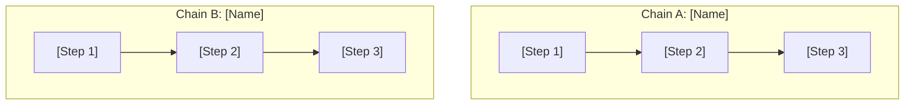
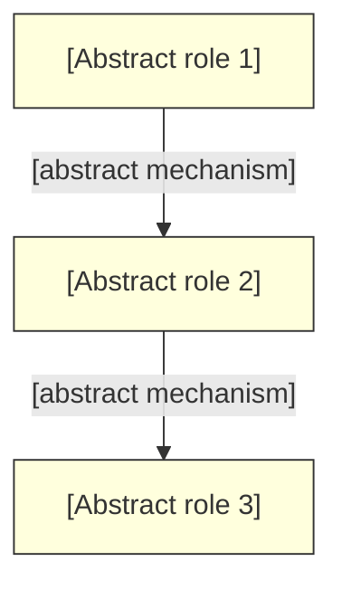
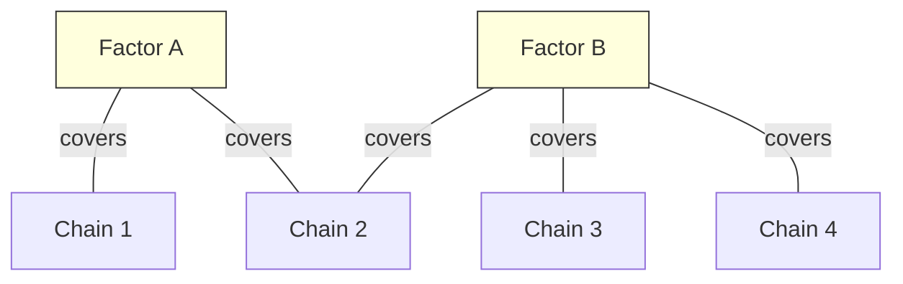

# Linear Phase Protocol

Detailed teaching templates and rubrics for the DLN Linear phase skill.

---

## 1. Cross-Pollination Question Templates

Use these to guide the learner toward discovering shared structure across chains they already know.

### Primary Templates

- "What do [chain A] and [chain B] have in common?"
- "If you squint, [process X] looks a lot like [process Y] — why?"
- "Strip away the domain-specific details from [chain] — what's the abstract structure?"

### Narrowing Templates (when the learner struggles)

- "Look at step [N] in [chain A] and step [M] in [chain B]. What role does each play?"
- "Both chains have a point where [observation]. Why does that keep showing up?"
- "If I swapped the domain vocabulary between these two chains, would the logic still hold?"

### Deepening Templates (when the learner sees surface similarity)

- "You said they're both about [surface feature]. Go deeper — *why* does that feature appear in both?"
- "That's the what. I want the why. What structural property makes [surface feature] inevitable here?"
- "If [surface feature] disappeared, would the chains still be related? What else connects them?"

---

## 2. Factor Hypothesis Prompts

Use these to push the learner from vague similarity toward precise, structural factor statements.

### Elicitation Prompts

- "Can you state that as a general principle?"
- "Would this factor still hold if we changed [variable]?"
- "What's the minimal statement that captures what you just noticed?"

### Precision Prompts

- "Your factor mentions [domain term]. Can you restate it without that term?"
- "If someone from a completely different field heard your factor, would they understand it?"
- "You said 'whenever [X], [Y] happens.' Are there exceptions? If so, what's the boundary condition?"

### Validation Prompts

- "Name a chain where this factor does NOT apply. Why not?"
- "Can you predict what would happen in [unseen scenario] using this factor alone?"
- "If this factor is true, what else must be true that you haven't checked yet?"

### Elaborative "Why" on Factors

After the learner states a factor with sufficient precision:

- "You've identified [factor]. Why does this pattern exist? What generates it?"
- "Why does [factor] appear in [chain A] AND [chain B]? Is there a deeper principle?"
- "If [factor] is true, what would HAVE to be true about the underlying system? Why?"
- "Could [factor] ever be false? Under what conditions, and why?"

---

## 3. Upgrade Operator Examples

Show how recognizing factors transforms the type of questions the learner can ask. Each example shows the Dot, Linear, and Network versions of a question.

### Example 1: Interest Rates

- **Dot:** "What happens when interest rates rise?"
- **Linear:** "What's the common factor between how rate rises affect bonds vs. how they affect housing?"
- **Network:** "What's the minimal model that predicts rate-rise effects across all asset classes?"

### Example 2: Sorting Algorithms

- **Dot:** "How does quicksort work?"
- **Linear:** "What do quicksort and mergesort share in terms of how they decompose the problem?"
- **Network:** "What's the minimal set of decomposition strategies that covers all comparison-based sorting?"

### Example 3: Machine Learning

- **Dot:** "What is regularization?"
- **Linear:** "What's the common factor between L2 regularization in linear models and dropout in neural networks?"
- **Network:** "What's the minimal principle set that explains why all forms of regularization improve generalization?"

### Example 4: Biology

- **Dot:** "What is homeostasis?"
- **Linear:** "What do thermoregulation and blood glucose regulation share structurally?"
- **Network:** "What's the minimal feedback model that predicts homeostatic behavior across all physiological systems?"

### How to Use

After presenting an example, ask the learner to:
1. Take one of their own Dot questions and upgrade it to Linear.
2. Explain what factor they had to recognize to make the upgrade.
3. Speculate on what the Network version might look like (park it in Open Questions).

---

## 4. Phase Gate Rubric

### Pass Criteria

All three must be met:

1. **Factor Articulation** — The learner can name at least 3 shared factors across their chains. Each factor must be:
   - Structural (describes a relationship, not a domain fact)
   - Stated without domain-specific vocabulary
   - Applicable to 2+ chains

2. **Unseen Problem Prediction** — Present a problem the learner has not encountered. They must predict the outcome by identifying which factor applies. Allow at most 1 hint. The prediction must be:
   - Correct in direction (even if not precise in magnitude)
   - Justified by explicit reference to a factor
   - Not just pattern-matching to a similar chain they memorized

3. **Minimal Principle Set** — The learner can articulate a set of factors that covers 80%+ of their known chains. The set must be:
   - Smaller than the number of chains (actual compression, not relabeling)
   - Non-overlapping (each factor covers distinct ground)
   - The learner can map each chain to its covering factor(s)

### Fail Criteria

Any of these indicate the learner is not ready for Network phase:

- **Vague factors** — "They're kind of similar" or "both involve change" without structural specificity.
- **Domain-locked factors** — Factors that only make sense within one domain and can't transfer.
- **Chain relabeling** — The "minimal principle set" is just their chains reworded, not compressed.
- **Transfer failure** — Cannot apply factors to unseen problems, or needs 2+ hints.
- **Coverage gaps** — Principle set covers less than 80% of known chains with no explanation for the gaps.

### Scoring

- **3/3 pass criteria met, 0 fail criteria triggered** — Pass. Update Phase to Network.
- **2/3 pass criteria met** — Near pass. Note which criterion failed, assign targeted practice, revisit next session.
- **1/3 or 0/3 pass criteria met** — Not ready. Continue Linear phase. Identify whether the issue is factor discovery (more cross-pollination needed) or factor precision (more hypothesis refinement needed).

## 5. Retrieval Warm-Up Question Bank

Use at the start of every Linear session to prompt factor recall.

### Factor Free Recall
- "Name every factor you've discovered so far. Just the names — we'll dig into them after."
- "What shared structures have you found across your chains?"
- "If you had to explain why your chains are related — not just that they're related — what principles would you cite?"

### Factor Explanation Prompts
- "Pick [factor] and tell me: which chains does it connect, and what's the structural relationship?"
- "Explain [factor] without using any domain-specific vocabulary."
- "If [factor] is true, what does it predict about a new chain you haven't seen?"

### Cued Recall (for forgotten factors)
- "There's a factor that connects [chain A] and [chain B]. Can you reconstruct what it might be?"
- "You noticed something about [specific step] that appears in multiple chains. What was the principle?"
- "Last session you said something like '[partial quote]'. Can you complete that thought?"

### Scoring Guide

| Score | Interpretation | Action |
|-------|---------------|--------|
| 80-100% factors recalled + structural explanations | Strong retention | Proceed with new comparisons |
| 50-79% factors recalled OR surface explanations | Moderate | Revisit weakest factor through a fresh chain comparison before new material |
| < 50% factors recalled | Significant decay | Run a full cross-pollination exercise on forgotten factors before introducing new comparisons |

## 6. Weakness-Driven Session Planning

### Factor Weakness Identification

In Linear phase, weaknesses come from two sources:

1. **Dot-level decay:** Concepts or chains the learner can no longer recall, detected during warm-up or cross-pollination. These re-enter the Weakness Queue with their original type (`concept` or `chain`) and phase (`Dot`).

2. **Factor-level weakness:** Factors that are `partial` or `not-mastered` after hypothesis or prediction attempts.

### Priority Computation for Linear Phase

Same formula as Dot phase, but factor weaknesses are weighted +1 higher than concept weaknesses at equivalent severity (since factor weakness is phase-appropriate and more actionable).

### Balance: Remediation vs. New Discovery

| Queue State | Session Allocation |
|-------------|-------------------|
| Empty | 100% new cross-pollination and factor discovery |
| 1-2 items, all `partial` | 20% warm-up remediation, 80% new work |
| 1-2 items, any `not-mastered` | 30% remediation, 70% new work |
| 3+ items | 40% remediation, 60% new work. Consider whether the learner was promoted to Linear too early. |

If the queue consistently has 3+ items across multiple Linear sessions, flag to the learner: "Your foundations might need more reinforcement. Would you like to do a Dot-phase refresher session?" This is a suggestion, not a forced regression.

## 7. Calibration Check Templates

### Pre-Gate Confidence Elicitation
- "Before the gate — rate 1-5: can you name 3+ shared factors right now?"
- "If I gave you a problem you've never seen, how confident are you that you could predict the outcome using a factor? Rate 1-5."
- "Could you articulate a minimal principle set that covers 80%+ of your chains? Rate 1-5."

### Post-Gate Calibration Feedback
- "You predicted [X] on factor articulation. You actually [named N factors / struggled to name 3]. Gap: [direction]."
- "Your prediction accuracy has [improved / stayed the same / gotten worse] compared to last session."

### Factor-Level Confidence Ratings
- "For each factor you've discovered, rate 1-5 how confident you are that it's truly structural and transferable:"
  - [Factor 1]: ___
  - [Factor 2]: ___
  - [Factor 3]: ___

## 8. Interleaving Protocol

### Interleaved Cross-Pollination Scheduling

When planning multiple comparisons in a session, schedule them to maximize context-switching:

#### Scheduling Rules
1. Never compare two chain pairs that share the same sub-domain consecutively
2. If possible, alternate between "likely to reveal new factor" and "likely to confirm existing factor" comparisons
3. Insert factor application questions between comparisons (test old factors on new pairs)

#### Factor Application Interjections

Between cross-pollination rounds, insert:
- "Does [existing factor] apply to this new pair? Why or why not?"
- "You're about to compare [chain C] with [chain D]. Before you look for a new factor — do any of your existing factors already cover this?"
- "Rate your confidence: is the factor here going to be new, or one you've already found?"

The last prompt is particularly useful — it builds metacognitive awareness of factor coverage and prevents the learner from always expecting novelty.

### "No Upgrade Available" Question Templates

For interleaved upgrade operator practice:
- "Here's a Dot question: [question]. Can you upgrade this to a Linear question? (It's possible there's no upgrade — not every question has one.)"
- "Upgrade these three questions. But be warned — one of them doesn't have a Linear upgrade. Which one, and why?"
- "[question A], [question B], [question C]. Two of these have factor-based upgrades. One is genuinely a standalone Dot question. Sort them."

## 9. Visual Representation Templates

### Visual Format Constraints

Claude Code operates in a text terminal. Available visual formats:

| Format | Best For | Limitations |
|--------|----------|-------------|
| **Mermaid diagrams** | Flowcharts, sequence diagrams, concept maps | Renders in Mermaid-compatible viewers; displays as readable code in terminal |
| **ASCII box diagrams** | Simple relationships, 2-4 nodes | Universal rendering; breaks down with 5+ nodes |
| **Indented tree structures** | Hierarchies, taxonomies | Easy to read; can't show cross-links |
| **ASCII tables** | Comparisons, side-by-side analysis | Universal; limited to tabular relationships |
| **Inline notation** | Quick inline relationships | `A → B → C` is clear for simple chains |

**Default choice:** Use **Mermaid** for anything with 3+ nodes and cross-links. Use **inline notation** (`A → B → C`) for simple chains mentioned in passing. Use **ASCII tables** for side-by-side comparisons.

**When to generate visuals:**
- After building a chain (show the chain as a diagram)
- During cross-pollination (side-by-side comparison)
- When the learner's verbal model gets complex enough to benefit from spatial layout (roughly 4+ interconnected concepts)
- When the learner requests it

**When NOT to generate visuals:**
- For single-concept delivery (a diagram of one node is pointless)
- When the relationship is genuinely linear with no branches (inline notation suffices)
- When the learner is overloaded (adding a visual format on top of verbal overload makes it worse)

### Side-by-Side Chain Comparison



Align structurally similar steps vertically to make the shared pattern visible.

### Factor Map (abstract pattern)



Use a distinct style (yellow fill) for factor diagrams to visually distinguish abstract patterns from concrete chains.

### Factor Coverage Map

After discovering multiple factors, show which chains each factor covers:



This makes the "minimal principle set" phase gate criterion visual — the learner can see coverage and gaps.

### Upgrade Operator Visualization

Show the three question levels as zoom levels on the same structure:

```
Dot level:    [A] → [B] → [C]          "What happens at each step?"
Linear level: [Factor] ⊃ {Chain1, Chain2}   "What do they share?"
Network level: [Model] ⊃ {F1, F2, F3}       "What's the minimal set?"
```
