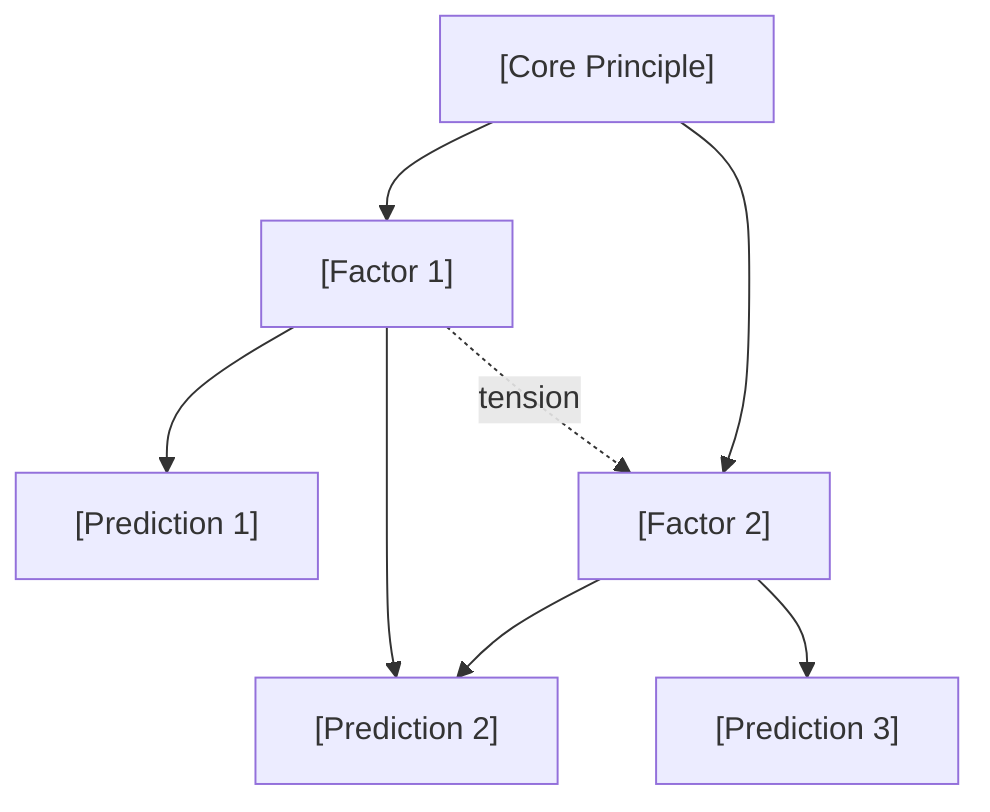
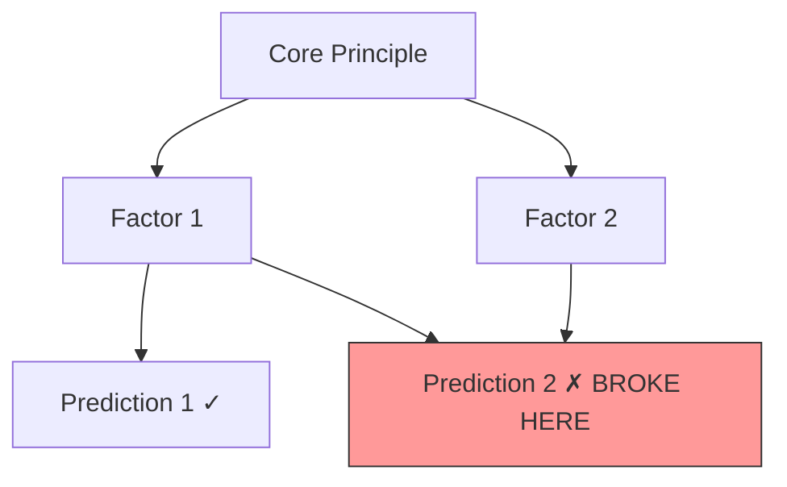
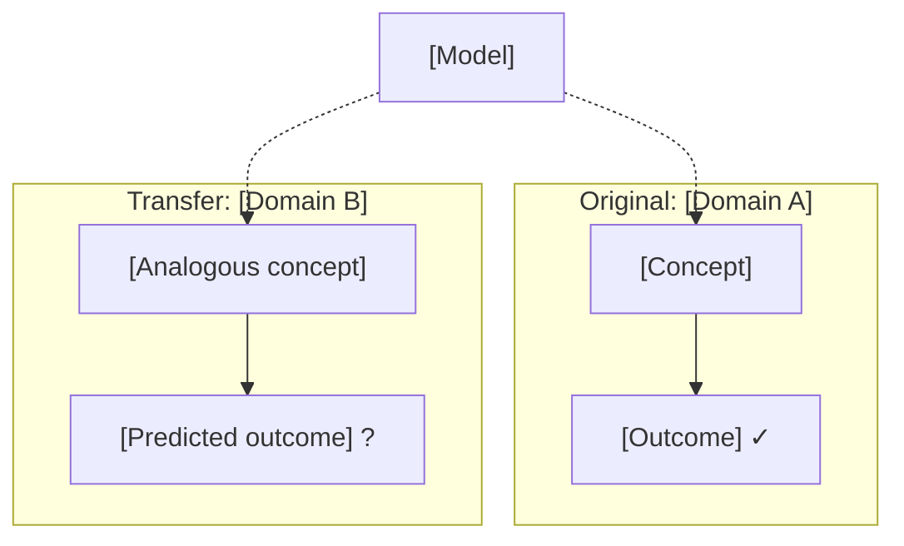

# Network Phase Protocol

Detailed teaching templates and rubrics for the DLN Network phase.

---

## 1. Distributed Revision Cycle Templates

### Eliciting the Model

- "In 3-5 sentences, explain [domain] as you understand it now. Don't look anything up — just tell me your current model."
- "If you had to teach [domain] to someone in 60 seconds, what would you say?"
- "What are the core principles that govern how [domain] works?"
- "Draw the causal chain: what causes what in [domain]?"

### Stress-Testing the Model

- "Your model says [X]. What happens when [edge case]? Does your model still hold?"
- "I'm going to give you three cases. For each one, tell me what your model predicts BEFORE I tell you the answer."
- "Here's a real-world example that experts find surprising. What does your model predict?"
- "What's the weakest part of your model? Where are you least confident?"

### Exploring Mismatches

- "Your model predicted [X] but the answer is [Y]. Before I explain why — what do you think went wrong?"
- "Which of your factors failed to account for this case?"
- "Is this a missing factor, or did you have the right factors but connect them incorrectly?"
- "If you had to add exactly one sentence to your model to cover this case, what would it be?"

### Pushing for Compression

- "Your revised model is [N] sentences. Can you cut it to [N-2] without losing coverage?"
- "Which two of your sentences overlap the most? Can you merge them?"
- "What's the single most important sentence in your model? If you could only keep one, which would it be?"
- "A good model is like a good equation — every term does work. Which of your sentences isn't doing enough work?"

---

## 2. Stress-Test Generation Prompts

Use these systematically to probe the learner's model:

### Boundary Probing

- "What happens at the boundary between [factor A] and [factor B]?"
- "At what point does [factor A] stop mattering and [factor B] take over?"
- "Is there a case where [factor A] and [factor B] point in opposite directions? What wins?"

### Assumption Falsification

- "Your model assumes [assumption] — what if that's false?"
- "In what context would [assumption] break down?"
- "Name one thing your model takes for granted. Now imagine a world where that's not true."

### Cross-Domain Challenge

- "In [adjacent domain], this works differently — can your model explain why?"
- "A practitioner in [other field] uses a completely different framework. Where does their model beat yours?"
- "If your model is truly general, it should apply to [distant analogy]. Does it?"

### Minimal Breaking Case

- "What's the simplest case that breaks your model?"
- "Can you construct the smallest possible example where your model gives the wrong answer?"
- "If I wanted to prove your model wrong, where would I look?"

---

## 3. Factor Discovery Question Bank

Use when stress-tests reveal new factors the learner hadn't identified:

### Relating New Factors to Existing Ones

- "You just found a new factor — how does it relate to your existing factors?"
- "Where does this new factor sit in your causal chain? Does it come before or after your existing factors?"
- "Which of your existing factors does this new one interact with most?"

### Testing for Subsumption

- "Does this factor subsume any of your previous factors?"
- "Is this really a new factor, or is it a special case of [existing factor]?"
- "If you zoom out, are [factor X] and this new factor both expressions of something deeper?"

### Merging and Deepening

- "Can you merge [factor X] and [factor Y] into a single deeper principle?"
- "What's the common thread between these factors? Name the underlying mechanism."
- "If you had to explain both [factor X] and [factor Y] with a single rule, what would it be?"

### Elaborative "Why" on Model Failures

After a stress-test reveals a model failure:

- "Your model broke on [case]. Why? Not what's missing — why did your model miss it?"
- "What assumption in your model made this failure inevitable?"
- "If you had to explain to someone WHY your model fails on [case], what would you say is the root cause?"
- "Is this failure because your model is wrong, or because it's incomplete? How would you tell the difference?"

After a model revision:

- "You added [new element] to your model. Why does this fix the problem? What principle does it encode?"
- "Could you have predicted this revision was needed before seeing the failure case? Why or why not?"

---

## 4. Structural Hypothesis Testing Prompts

Push the learner to make testable predictions from their model:

### Forward Prediction

- "If your model is correct, what else must be true?"
- "Your model implies [consequence]. Is that actually the case?"
- "Make a prediction from your model that we can test right now."

### Falsification

- "What would falsify your current model?"
- "If I showed you [specific evidence], would that break your model or could your model explain it?"
- "What's the strongest argument against your model?"

### Sufficiency Testing

- "Your model has [N] factors. Are they sufficient to explain [domain], or is something still missing?"
- "If I gave you a new case you've never seen, could your model handle it? Let's try."
- "What class of cases is your model weakest on?"

---

## 5. Compression Quality Rubric

Rate the learner's compressed model each session:

### High Compression Quality

- Model is **5 sentences or fewer**
- Covers **90%+ of known cases** (including edge cases encountered in session)
- Every sentence does meaningful work (no redundancy)
- Model makes correct predictions on transfer tests

### Medium Compression Quality

- Model is **5-10 sentences**, OR
- Covers **70-90% of known cases**
- Some redundancy or overlap between sentences
- Model partially succeeds on transfer tests

### Low Compression Quality

- Model is **verbose (>10 sentences)**, OR
- Covers **less than 70% of known cases**
- Significant redundancy or vague language
- Model fails on transfer tests

### Tracking Across Sessions

Track the **compression ratio** over time:

```
Compression Ratio = (cases covered) / (sentences in model)
```

A rising compression ratio means the learner is building a more powerful, more concise model. This is the primary indicator of Network-phase progress.

---

## 6. Transfer Test Templates

### Applying to Adjacent Domains

- "Apply your model to [adjacent domain]. What does it predict?"
- "A beginner in [adjacent domain] asks you to explain [concept]. Using only your model, what would you say?"
- "Your model was built for [original domain]. Does it work for [adjacent domain] without modification?"

### Diagnosing Transfer Failure

- "Where does the transfer break down? What's domain-specific vs. universal?"
- "Your model worked for [original case] but not [transfer case]. What's different?"
- "Is the failure because of a missing factor, or because [domain] operates on different principles entirely?"

### Cross-Practitioner Testing

- "A practitioner in [other field] would say [X] — does your model agree or disagree?"
- "In [other field], the standard explanation is [Y]. Is that compatible with your model, or does one of them have to be wrong?"
- "If you and a [other field] expert both looked at [shared phenomenon], would you explain it the same way?"

---

## 7. Calibration Check Templates

### Pre-Stress-Test Prediction
- "Before I challenge your model — where do you think it will break?"
- "Rate 1-5: how confident are you that your model can handle edge cases?"
- "If I picked a random case from [adjacent domain], would your model work? Rate 1-5."

### Post-Stress-Test Calibration
- "You predicted your model would break at [X]. It actually broke at [Y]."
- "Your model held where you expected it to fail — and failed where you expected it to hold. What does that tell you?"
- "Your prediction about your model's weakness was [accurate / inaccurate]. Self-knowledge of your model's limits is itself a form of understanding."

### Model Confidence vs. Model Quality
| Self-Rating | Compression Quality (from Rubric) | Interpretation |
|-------------|-----------------------------------|----------------|
| High confidence + High quality | Well-calibrated expert | Reduce guidance, increase challenge |
| High confidence + Low quality | Dunning-Kruger risk | Intensify stress-tests, surface failures gently |
| Low confidence + High quality | Impostor pattern | Reinforce wins, surface the evidence |
| Low confidence + Low quality | Appropriate humility | Standard teaching, build up systematically |

## 8. Interleaving Protocol

### Cross-Factor Stress-Test Scheduling

When designing a stress-test sequence, use the following scheduling template:

#### Sequence Template (for N factors)
1. Boundary probe — Factor [random]
2. Assumption falsification — Factor [different from #1]
3. Cross-factor interaction — Factors [any two]
4. Minimal breaking case — Factor [different from #2 and #3]
5. Cross-domain challenge — Factor [different from #4]
6. Cross-factor interaction — Factors [different pair from #3]

#### Scheduling Rules
1. Never test the same factor with the same probe type twice in a row
2. Include at least one cross-factor interaction test for every 3 single-factor tests
3. Vary probe types (boundary, assumption, cross-domain, minimal break) — don't run the same type consecutively
4. If a factor breaks under test, don't immediately re-test it — test a different factor first, then return

#### Cross-Factor Interaction Templates
- "Factors [A] and [B] both apply to this case. They predict [different outcomes]. What actually happens, and what does that tell you about the boundary between them?"
- "Build me a scenario where [Factor A] dominates. Now modify it slightly so [Factor B] takes over. What changed?"
- "Your model uses [Factor A] and [Factor B] independently. Are they truly independent, or does one constrain the other?"

## 9. Visual Representation Templates

### Visual Format Constraints

Claude Code operates in a text terminal. Available visual formats:

| Format | Best For | Limitations |
|--------|----------|-------------|
| **Mermaid diagrams** | Flowcharts, sequence diagrams, concept maps | Renders in Mermaid-compatible viewers; displays as readable code in terminal |
| **ASCII box diagrams** | Simple relationships, 2-4 nodes | Universal rendering; breaks down with 5+ nodes |
| **Indented tree structures** | Hierarchies, taxonomies | Easy to read; can't show cross-links |
| **ASCII tables** | Comparisons, side-by-side analysis | Universal; limited to tabular relationships |
| **Inline notation** | Quick inline relationships | `A → B → C` is clear for simple chains |

**Default choice:** Use **Mermaid** for anything with 3+ nodes and cross-links. Use **inline notation** (`A → B → C`) for simple chains mentioned in passing. Use **ASCII tables** for side-by-side comparisons.

**When to generate visuals:**
- After building a chain (show the chain as a diagram)
- During cross-pollination (side-by-side comparison)
- When the learner's verbal model gets complex enough to benefit from spatial layout (roughly 4+ interconnected concepts)
- When the learner requests it

**When NOT to generate visuals:**
- For single-concept delivery (a diagram of one node is pointless)
- When the relationship is genuinely linear with no branches (inline notation suffices)
- When the learner is overloaded (adding a visual format on top of verbal overload makes it worse)

### Model Concept Map



Use solid arrows for causal/supporting links. Dotted arrows for tensions, trade-offs, or boundary conditions.

### Before/After Compression Comparison

Render the model before and after revision as two diagrams. Count nodes and edges:

```
Before: [N] nodes, [M] edges
After:  [N'] nodes, [M'] edges
Compression: [ratio]
```

### Stress-Test Annotation

When a stress-test breaks the model, annotate the diagram to show WHERE it broke:



Use red styling for the broken node/edge. This gives the learner a spatial anchor for where their model needs revision.

### Transfer Test Map

Show the original domain and transfer domain side by side, with the model applied to both:



### Verbal "Diagram Description" Prompts

Since learners can describe but not draw:

- "If your model were a map, what would be at the center? What connects to it?"
- "Draw your model verbally: what are the 3-4 most important nodes, and what are the arrows between them?"
- "Your last model had [N] nodes. After this revision, how many do you need? What did you merge?"
